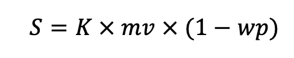
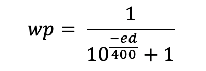
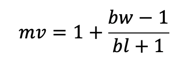
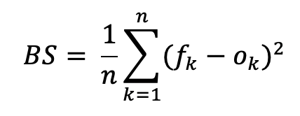
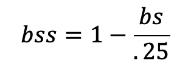

**Methodology**
---------------

Our rankings rank teams based on an elo system. In elo systems, after every game/round occurs, the winning teams takes a certain number of points from the losing team based on the arithmetic difference of their scores, such that beating a strong team yields more points and beating a weaker team fewer points. The number of points is determined by the following formula:

where _S_ represents the shift in Elo, _K_ is a semi-arbitrary factor (more on this later), _mv_ is the margin of victory, and _wp_ is the probability that the team that won the round would have won based on their elo. The variable _wp_ is calculated as follows:

where _ed_ represents the elo difference between the two teams. For example, if a team with an elo of 1900 debates a team with an elo of 1500, the probability per this system that the higher ranked team wins is 10/11, or 91%. If two teams have the same elo, then the fraction _wp_ becomes simply .5, which makes sense. Let’s take a look at how _K_ and _mv_ are calculated.

The default value for _K_ in our rankings is 50. This means that, ignoring _mv_, the most points you can gain from one round is 50 (by defeating an infinitely stronger team). We chose to cap the number of points you can lose in one round because a) people always have rounds off and b) judging can be very inconsistent. However, we weight tournaments by their bid level. In order to do this, we weight octos bids fully, but halve the value of _K_ for each tier down. That means that quarters bids have _K_\=25, and so on. This is to avoid idiosyncratic results from small finals bids influencing the rankings too much. **This is a methodology change, as the rankings used to run with K=25. We found that this higher value of K made the rankings more dynamic and reduced the bias towards frequent competition.**

Now let’s talk about _mv_. In a prelim round, _mv_ is always 1, because you can’t win a prelim by more than one ballot. In an outround, however, we use the formula

where _bw_ is the number of ballots won and _bl_ the number of ballots lost. For example, winning an elim on a 3-2 decision yields _mv_\=1.67. This formula is designed to weight elim wins based on the agreement of the judges as a 2-1 decision is less decisive than a 3-0. Finally, the winning team of all outrounds receive a bonus of _e_ elo points, where _e_\=_b_/2, where _b_ is the number of bids available at the tournament.

It is worth noting that this last piece of methodology is the **only place where the rankings reward frequency of competition**, and it is nowhere near as important as the normal elo shifts, because they are far larger. In general, elo systems favor _consistency_ over frequency of competition.

‍

Accuracy
--------

To assess the accuracy of our rankings, we checked their Brier Scores and Brier Skill Scores for the last three PF octos bids: Glenbrooks, Apple Valley, and Blue Key. Brier Scores are a widely-accepted statistical tool to assess the accuracy of probabilistic forecasts, like ours. The formula for the Brier Score is as follows:

where _f_ is the probability given by our elo function and _o_ is the actual outcome. For example, if our model says that team 1 has an 60% chance of winning a round and they go on to win, we add 0.42\=0.16 to the Brier Score sum. The lower the Brier Score, the more accurate the model. A model that assumes every round is a coin toss would achieve a Brier Score of .25 on average. Here are the Brier Scores for these tournaments:

| Tournament | Prelims/Elims | Brier Score |
|------------|---------------|-------------|
| ASU | Prelims       | .180        |
| ASU | Elims         | .086        |
| Sunvite | Prelims       | .163        |
| Sunvite | Elims         | .124        |
| Emory | Prelims       | .158        |
| Emory | Elims         | .187        |

To assess the quality of the Brier Scores, we can convert them to Brier Skill Scores using the following formula:

We used the value .25 because that is the Brier Score we’d expect a random forecast to achieve. Unlike with Brier Scores, higher Brier Skill Scores are better. Here are the scores:

| Tournament | Prelims/Elims | Brier Skill Score |
|------------|---------------|-------------|
| ASU | Prelims       | .281        |
| ASU | Elims         | .657        |
| Sunvite | Prelims       | .348        |
| Sunvite | Elims         | .505        |
| Emory | Prelims       | .366        |
| Emory | Elims         | .254        |

Since we based our elo forecast on FiveThirtyEight’s, we can compare our Brier Skill Scores with [theirs](https://projects.fivethirtyeight.com/checking-our-work/). In general, the rankings are roughly in the middle of the pack when compared to FiveThirtyEight’s sports forecasts, which is exactly where we’d expect to be, considering we based our model off these forecasts. Their politics forecasts do perform better than ours, which makes sense because the vast majority of elections are not close and thus easy to forecast (ex. the presidential race in Alabama).

Especially considering that the season is still young and our rankings do not have a lot of data on most teams, this is a very good result. From our data, we see that in general the rankings perform quite well, but particularly well in elimination rounds. This makes sense because these rounds typically see more experienced teams that our rankings have more data points on as well as experienced panels of judges.

